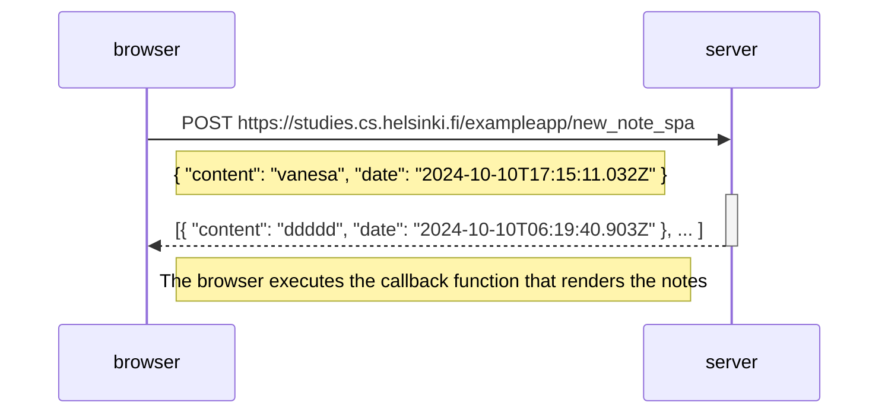

```mermaid

sequenceDiagram
participant browser
participant server

browser->>server: POST https://studies.cs.helsinki.fi/exampleapp/new_note_spa
Note right of browser: { "content": "vanesa", "date": "2024-10-10T17:15:11.032Z" }
activate server
server-->>browser: [{ "content": "ddddd", "date": "2024-10-10T06:19:40.903Z" }, ... ]
deactivate server

Note right of browser: The browser executes the callback function that renders the notes
```